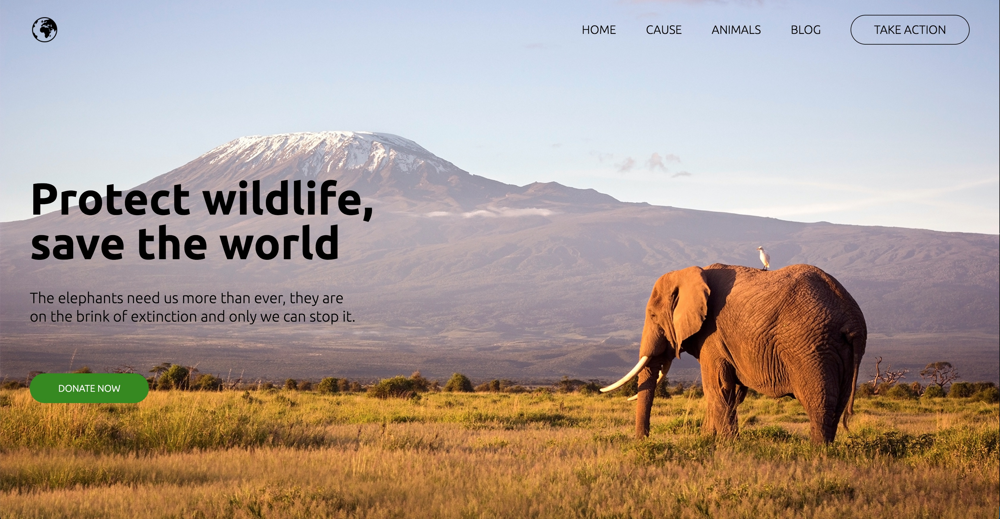
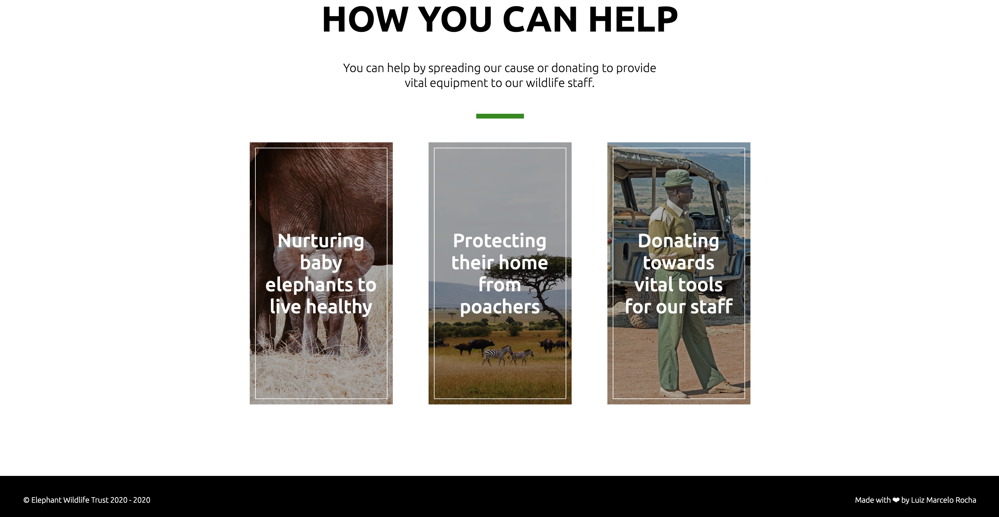
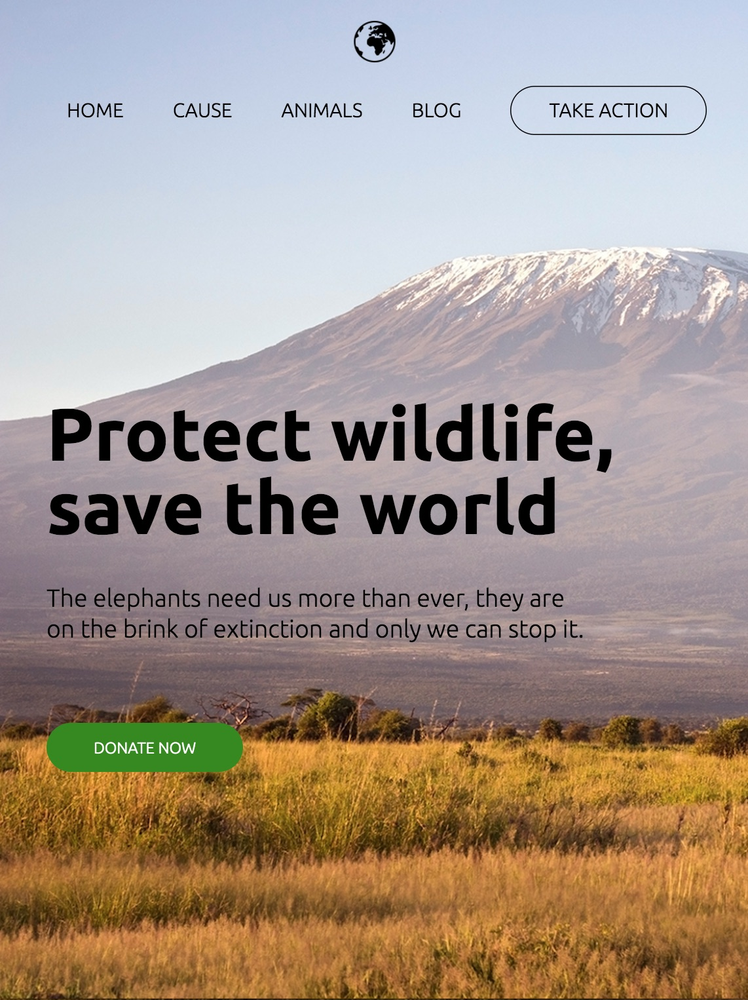
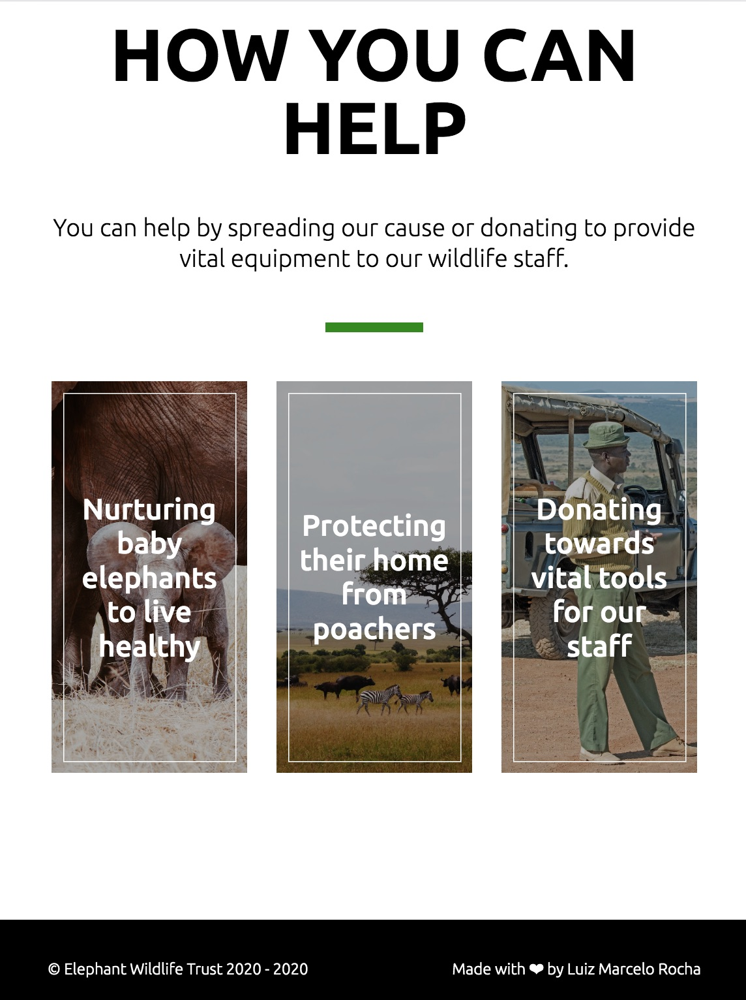
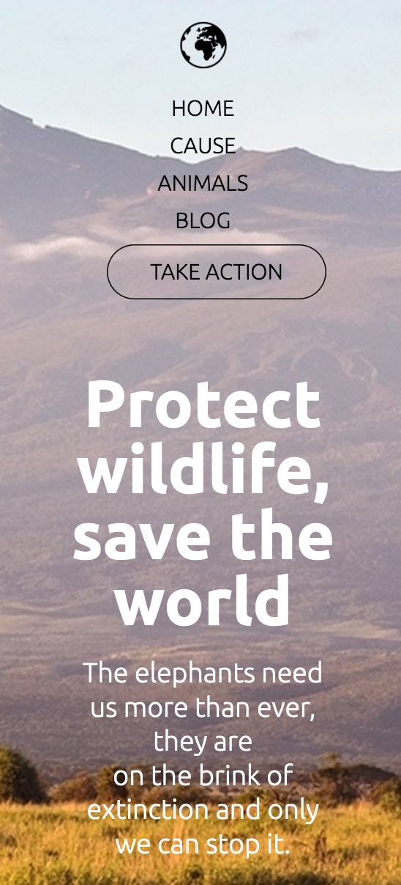
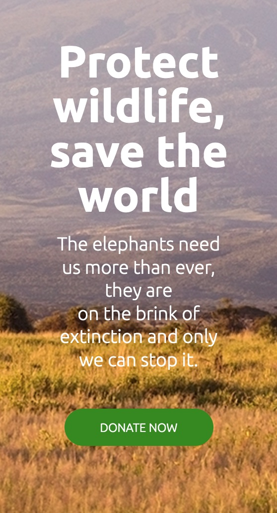
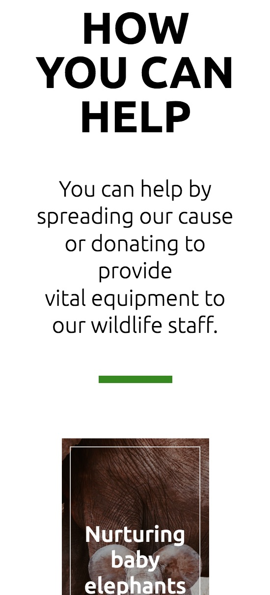
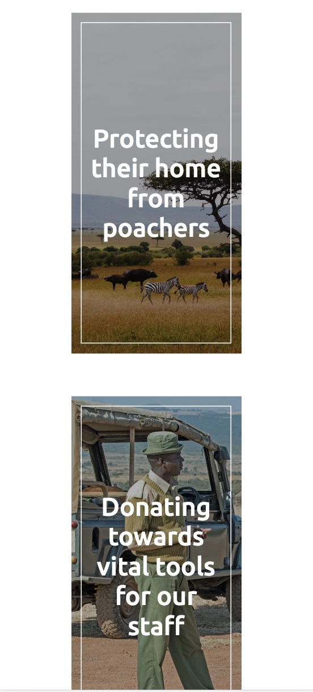
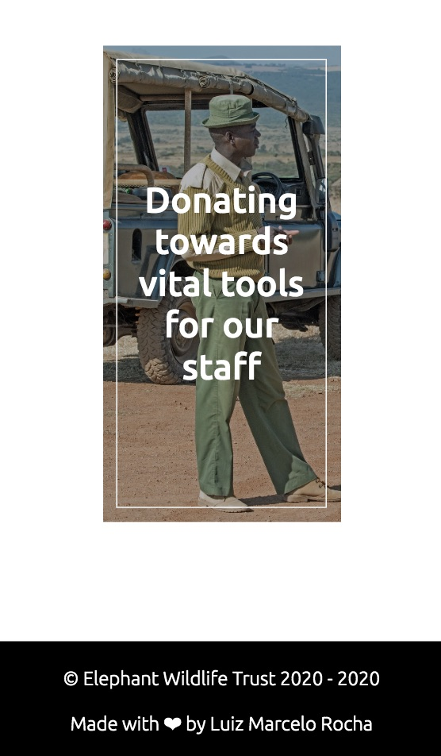

<h1 align="center">
    
</h1>

## 💻 About project

A home page made for a fictitious organization which helps Elephants on the Africa continent, where users can donate an amount of money. It is a responsive web page, which can be opened in every device's size.

## 🎨 Layout

### Web

<p align="center" style="display: flex; align-items: flex-start; justify-content: center;">
  
  
</p>

### Ipad

<p align="center" style="display: flex; align-items: flex-start; justify-content: center;">
  
  

</p>

### Mobile

<p align="center" style="display: flex; align-items: flex-start; justify-content: center;">
  
  
  <br/>
  
  
  <br/>
  

</p>

## 🛠 Technology

#### **Website**

-   **[HTML5](https://developer.mozilla.org/pt-BR/docs/Web/HTML/HTML5)**
-   **[SCCS](https://sass-lang.com/)**
-   **[JavaScript](https://developer.mozilla.org/pt-BR/docs/Web/JavaScript)**

#### **Utilitaries**

-   Editor: **[Visual Studio Code](https://code.visualstudio.com/)**;
-   Fonts: **[Ubuntu](https://fonts.googleapis.com/css2?family=Ubuntu:wght@300;400;500;700&display=swap)**

### Prerequisites

Before you begin, you will need to have the following tool installed on your machine:
[Git](https://git-scm.com)

In addition, it is good to have an editor to work with the code as [VSCode][vscode]

### 🧭 Running the web application (Front End)

```bash
# Clone this repository
$ git clone https://github.com/luizmr/wildlife-page

# Access the project folder in the cmd/terminal
$ cd wildlife-page

# Run the application in terminal
$ npx http-server
```

## 📝 License

This project is under the MIT license.

Made with ❤️ by Luiz Marcelo Rocha
